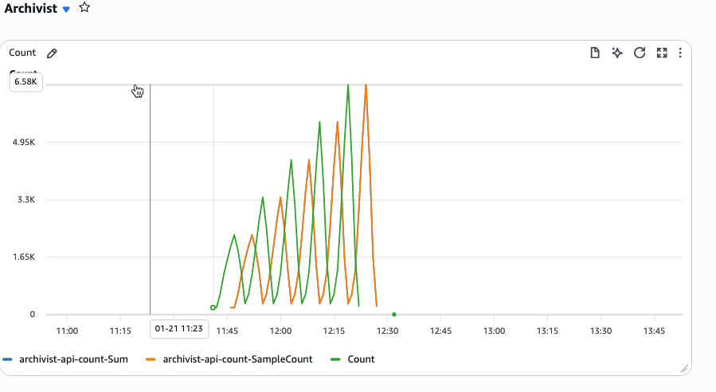

# Metric Archivist

A serverless AWS application that migrates CloudWatch metrics to S3 for long-term archival and cost optimization, with support for time-shifted data visualization through a custom CloudWatch data source.

## Overview

CloudWatch metric storage can be expensive for long-term retention. This system archives older metrics to cheaper S3 storage while maintaining access to historical data through a custom CloudWatch data source connector that supports time-shifting capabilities.

## Architecture



The application consists of the following components:

- **API Gateway**: REST API endpoint for triggering metric migrations
- **MetricMigrationTrigger Lambda**: Validates migration requests and queues them for processing
- **SQS Queue**: Decouples API requests from migration processing with built-in retry logic
- **Dead Letter Queue**: Captures failed migration attempts for troubleshooting
- **MigrateMetricFunction Lambda**: Retrieves metrics from CloudWatch and writes them to S3 in CSV format
- **S3 Bucket**: Stores archived metrics with encryption and versioning enabled
- **TimeshiftLambda**: Custom CloudWatch data source connector for time-shifted visualization

### Data Flow

1. Client sends POST request to `/migrate` endpoint with metric details
2. MetricMigrationTrigger validates the request and sends message to SQS
3. MigrateMetricFunction processes the SQS message:
   - Queries CloudWatch for metric data
   - Converts data to CSV format
   - Uploads to S3 bucket
4. TimeshiftLambda enables visualization of archived metrics with time-shifting

## Features

### Metric Migration
- Migrates CloudWatch metrics to S3 for cost-effective long-term storage
- Supports all CloudWatch statistics: `Average`, `Minimum`, `Maximum`, `Sum`, `SampleCount`, `IQM`, `p99`, `tm99`, `tc99`, `ts99`
- Validates request parameters (namespace, metric name, dimensions, time ranges)
- Asynchronous processing with error handling and retry mechanisms
- Automatic pagination for large metric datasets
- CSV output format compatible with CloudWatch S3 data sources

### Time-Shifted Data Visualization
The custom CloudWatch connector allows you to:
- Graph archived metric series against current CloudWatch metrics
- Apply arbitrary time shifts using ISO 8601 duration strings
- Create year-over-year comparisons (e.g., current day vs. same day previous year)
- Build dashboards comparing historical patterns with current performance

**Example Use Case**: An eCommerce operator can create a dashboard showing current day Order Rate vs. the same day from the previous year, enabling easy year-over-year performance comparison.

## Prerequisites

- AWS CLI configured with appropriate credentials
- AWS SAM CLI installed
- Python 3.13 or later
- An existing S3 CSV Data Source configured in CloudWatch (for time-shifting feature)

## Deployment

### Step 1: Set up S3 CSV Data Source (Required for Time-Shifting)

Before deploying this application, you need to create an S3 CSV Data Source in CloudWatch:

1. Follow the [AWS documentation](https://docs.aws.amazon.com/AmazonCloudWatch/latest/monitoring/CloudWatch-Metrics-Insights-datasources-S3.html) to set up an S3 CSV Data Source
2. Note the Lambda ARN created by CloudWatch (you'll need this for deployment)
3. Find the ARN in the CloudWatch console under **Data Sources**

### Step 2: Build and Deploy

```bash
# Build the application
sam build

# Deploy with guided prompts
sam deploy --guided
```

During deployment, you'll be prompted for:
- **Stack Name**: Name for your CloudFormation stack (e.g., `metric-archivist`)
- **AWS Region**: Target region for deployment
- **DataSourceName**: Name for your custom CloudWatch data source
- **S3CsvLoadingLambdaArn**: ARN of the Lambda function from Step 1

### Step 3: Note the Outputs

After deployment, SAM will output:
- **MetricMigrationTriggerApi**: API endpoint URL for triggering migrations
- **MetricMigrationQueueUrl**: SQS queue URL
- **ArchivedMetricsS3Bucket**: S3 bucket name for archived metrics

## Usage

### Triggering a Metric Migration

Send a POST request to the `/migrate` endpoint:

```bash
curl -X POST https://your-api-id.execute-api.region.amazonaws.com/Prod/migrate \
  -H "Content-Type: application/json" \
  -d '{
    "namespace": "AWS/Lambda",
    "metricName": "Invocations",
    "dimensions": [
      {"Name": "FunctionName", "Value": "MyFunction"}
    ],
    "startTime": "2024-01-01T00:00:00Z",
    "endTime": "2024-01-31T23:59:59Z",
    "destinationMetricName": "ArchivedInvocations",
    "destinationKey": "lambda/invocations/2024-01.csv",
    "cloudwatchStats": ["Sum", "Average"]
  }'
```

### Request Parameters

| Parameter | Type | Required | Description |
|-----------|------|----------|-------------|
| `namespace` | string | Yes | CloudWatch namespace (e.g., `AWS/Lambda`) |
| `metricName` | string | Yes | Name of the metric to migrate |
| `dimensions` | array | Yes | Array of dimension objects with `Name` and `Value` |
| `startTime` | string | Yes | Start time in ISO 8601 format |
| `endTime` | string | Yes | End time in ISO 8601 format |
| `destinationMetricName` | string | Yes | Name for the archived metric in CSV |
| `destinationKey` | string | Yes | S3 key path for the CSV file |
| `cloudwatchStats` | array | Yes | Array of statistics to migrate |

### Response

**Success (200):**
```json
{
  "request": { ... },
  "message": "Query request received successfully"
}
```

**Validation Error (400):**
```json
{
  "error": "Validation Error",
  "message": "Missing required field: namespace"
}
```

### Using Time-Shifted Metrics in CloudWatch

Once metrics are archived to S3, you can visualize them with time-shifting:

1. Open CloudWatch console
2. Navigate to **Metrics** → **All metrics**
3. Select your custom data source
4. Configure the query arguments:
   - **Arg 1**: S3 bucket name (e.g., `my-archived-metrics-bucket`)
   - **Arg 2**: S3 key (e.g., `lambda/invocations/2024-01.csv`)
   - **Arg 3**: ISO 8601 duration string (e.g., `P1Y` for 1 year shift)

#### ISO 8601 Duration Examples

| Duration String | Description |
|----------------|-------------|
| `P0D` | No shift (current time) |
| `P1D` | Shift forward 1 day |
| `P1W` | Shift forward 1 week |
| `P1M` | Shift forward 1 month |
| `P1Y` | Shift forward 1 year |
| `P1Y2M3D` | Shift forward 1 year, 2 months, 3 days |
| `PT1H` | Shift forward 1 hour |
| `P1DT12H` | Shift forward 1 day and 12 hours |

## Testing

### Load Testing with k6

The `k6/` directory contains load testing scripts for generating test data and validating the migration pipeline:

```bash
# Install k6 (if not already installed)
# macOS: brew install k6
# Other: https://k6.io/docs/getting-started/installation/

# Run the load test
k6 run k6/script.js
```

The k6 script will:
- Generate sample metric migration requests
- Test API endpoint performance
- Validate response times and error rates

### Manual Testing

Test the API endpoint directly:

```bash
# Get the API endpoint from stack outputs
API_URL=$(aws cloudformation describe-stacks \
  --stack-name metric-archivist \
  --query 'Stacks[0].Outputs[?OutputKey==`MetricMigrationTriggerApi`].OutputValue' \
  --output text)

# Send a test request
curl -X POST $API_URL \
  -H "Content-Type: application/json" \
  -d @test-request.json
```

## Monitoring

### CloudWatch Logs

Each Lambda function writes logs to CloudWatch Logs:
- `/aws/lambda/metric-archivist-MetricMigrationTrigger-*`
- `/aws/lambda/metric-archivist-MigrateMetricFunction-*`
- `/aws/lambda/metric-archivist-TimeshiftLambda-*`

### SQS Metrics

Monitor queue health:
- `ApproximateNumberOfMessagesVisible`: Messages waiting to be processed
- `ApproximateNumberOfMessagesNotVisible`: Messages being processed
- `ApproximateAgeOfOldestMessage`: Age of oldest message in queue

### Dead Letter Queue

Check the DLQ for failed migrations:

```bash
aws sqs receive-message \
  --queue-url $(aws cloudformation describe-stacks \
    --stack-name metric-archivist \
    --query 'Stacks[0].Outputs[?OutputKey==`MetricMigrationDLQUrl`].OutputValue' \
    --output text)
```

## Cost Optimization

This solution helps reduce CloudWatch costs:

- **CloudWatch Metrics**: $0.30 per metric per month (first 10,000 metrics)
- **S3 Standard**: $0.023 per GB per month
- **S3 Glacier**: $0.004 per GB per month (for long-term archival)

For metrics older than 15 months, migrating to S3 can reduce storage costs by up to 90%.

## Troubleshooting

### Common Issues

**Issue**: `S3_CSV_LOADING_LAMBDA_ARN environment variable is not set`
- **Solution**: Ensure you've created an S3 CSV Data Source in CloudWatch and provided the Lambda ARN during deployment

**Issue**: Migration request returns 400 error
- **Solution**: Verify all required fields are present and properly formatted (especially ISO 8601 timestamps)

**Issue**: No data in S3 after migration
- **Solution**: Check CloudWatch Logs for the MigrateMetricFunction and verify the metric exists in CloudWatch

**Issue**: Time-shifted metrics not appearing in CloudWatch
- **Solution**: Verify the S3 bucket name and key are correct, and the CSV file exists

## Security

- S3 bucket has encryption enabled (AES256)
- S3 bucket blocks all public access
- Lambda functions use least-privilege IAM roles
- API Gateway can be configured with authentication (not included in this template)

## Cleanup

To remove all resources:

```bash
sam delete --stack-name metric-archivist
```

Note: The S3 bucket and SQS queues have retention policies and may need to be manually deleted if they contain data.

## License

This project is licensed under the MIT-0 License.
